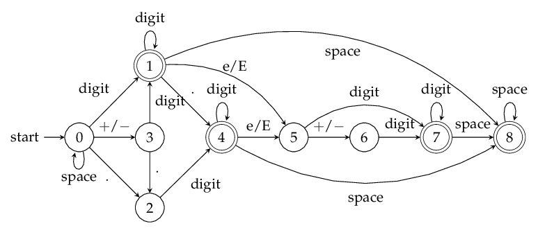

# 1. deterministic finite automaton (DFA) solution by SimonS
* 0 no input or just spaces 
* 1 input is digits 
* 2 no digits in front just Dot 
* 3 sign 
* 4 digits and dot in front 
* 5 input 'e' or 'E' 
* 6 after 'e' input sign 
* 7 after 'e' input digits 
* 8 after valid input input space

